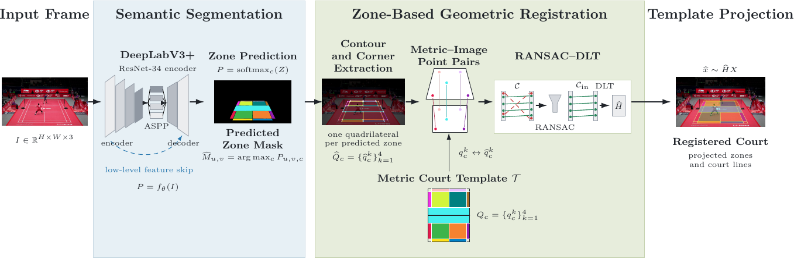
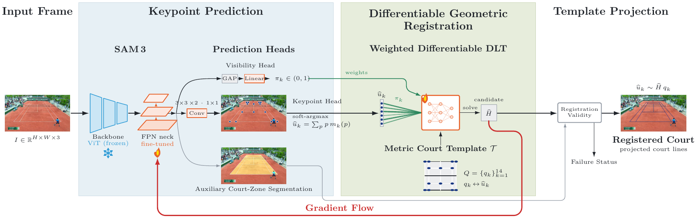
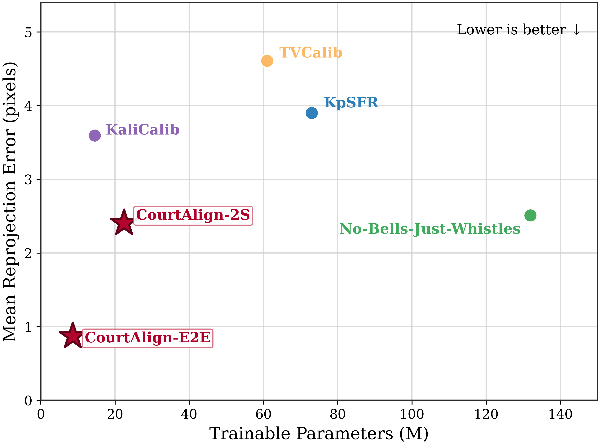
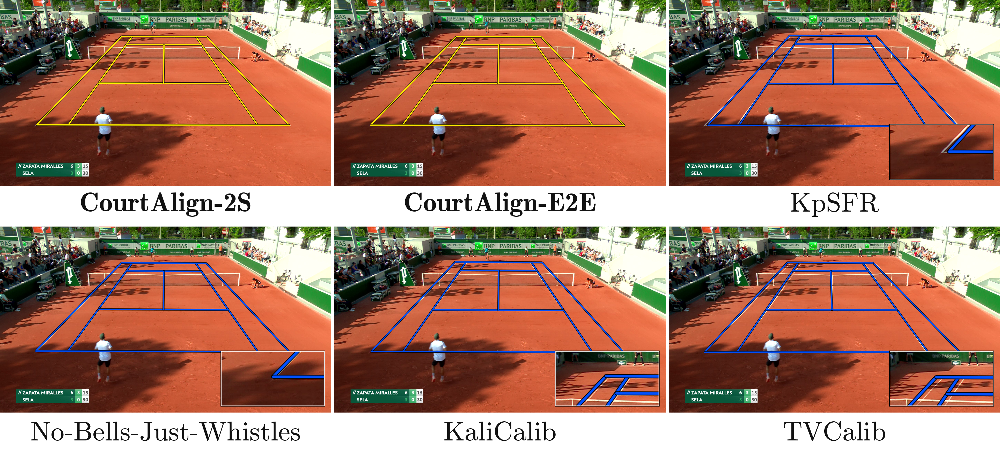
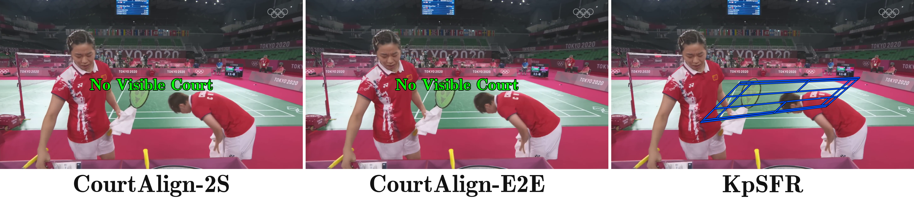

# CourtAlign: A Deep Learning-Based Framework for Racket Sports Court Registration

CourtAlign provides two methods for monocular tennis and badminton court
registration. Both methods estimate a homography from the metric court model to
the input image and are evaluated with the same frozen test protocol.

- **CourtAlign-2S** combines semantic court segmentation with classical
  correspondence extraction, RANSAC, and DLT. The final model uses a
  DeepLabV3+ decoder and an ImageNet-pretrained ResNet-34 encoder. Tennis uses a
  binary full-court mask, while badminton uses 13 semantic court zones.

  [](https://doi.org/10.1007/978-3-031-63219-8_2)

- **CourtAlign-E2E** predicts semantic masks and geometric correspondences from
  a frozen SAM 3 vision trunk, a fine-tuned feature-pyramid neck, and learned
  task heads. A confidence-weighted differentiable DLT layer estimates the
  homography during training and inference.

The repository contains the final training and evaluation code, frozen splits,
official geometric ground truth, pretrained-weight instructions, and a video
court-tracking application for both methods.

## Method overview

### CourtAlign-2S

[](docs/figures/courtalign_2s_pipeline.pdf)

CourtAlign-2S builds on the method introduced in our published
[AIAI 2024 paper](https://doi.org/10.1007/978-3-031-63219-8_2). The implementation
provided here uses ResNet-34 for both sports. The learned segmentation stage is
followed by the method-specific classical registration stage.

### CourtAlign-E2E

[](docs/figures/courtalign_e2e_pipeline.pdf)

CourtAlign-E2E jointly supervises semantic prediction, image correspondences,
and homography accuracy. The SAM 3 vision transformer remains frozen, while
the feature-pyramid neck and prediction heads are optimized on the target
sport. Both final configurations predict the official line-axis landmarks.
The registration objective applies a Huber penalty to reprojection distances
in input pixels, using a 1-pixel transition and a 50-pixel stability clamp.

## Quantitative comparison

All overlap and PCK values below are fractions in `[0, 1]`. Projection error is
measured in meters on the reference court. Reprojection error is measured in
native image pixels. NC-FP counts false registrations on non-registrable test
frames. Full definitions and the LaTeX table are provided in
[`docs/benchmark/comparison_table.tex`](docs/benchmark/comparison_table.tex).

### Tennis

| Method | IoU ↑ | Projection ↓ | Reprojection ↓ | PCK-H@5 ↑ | PCK-H@10 ↑ | Line-IoU@0 ↑ | @3 ↑ | @5 ↑ | NC-FP ↓ |
|---|---:|---:|---:|---:|---:|---:|---:|---:|---:|
| KpSFR | 0.9647 | 0.1186 m | 3.9002 px | 0.4509 | 0.8571 | 0.0697 | 0.4161 | 0.5623 | 0/1 |
| No-Bells-Just-Whistles | 0.9899 | 0.0605 m | 2.5114 px | 0.8470 | 0.9921 | 0.1156 | 0.5771 | 0.6945 | 1/1 |
| KaliCalib | 0.9553 | 0.0814 m | 3.5965 px | 0.5620 | 0.9921 | 0.0994 | 0.4808 | 0.6195 | 1/1 |
| TVCalib | 0.9811 | 0.1079 m | 4.6104 px | 0.5209 | 0.9192 | 0.0736 | 0.4706 | 0.6090 | 0/1 |
| **CourtAlign-2S** | **0.9964** | 0.0501 m | 2.4077 px | 0.8420 | 0.9913 | 0.1333 | 0.5989 | 0.7100 | **0/1** |
| **CourtAlign-E2E** | 0.9960 | **0.0225 m** | **0.8728 px** | **0.9733** | **1.0000** | **0.1854** | **0.6507** | **0.7511** | **0/1** |

### Badminton

| Method | IoU ↑ | Projection ↓ | Reprojection ↓ | PCK-H@5 ↑ | PCK-H@10 ↑ | Line-IoU@0 ↑ | @3 ↑ | @5 ↑ | NC-FP ↓ |
|---|---:|---:|---:|---:|---:|---:|---:|---:|---:|
| KpSFR | 0.9921 | 0.0280 m | **1.5817 px** | 0.9875 | 1.0000 | 0.1318 | 0.5679 | 0.6792 | 1/9 |
| No-Bells-Just-Whistles | 0.9932 | 0.0528 m | 2.8805 px | 0.9764 | 1.0000 | 0.1108 | 0.5340 | 0.6523 | **0/9** |
| KaliCalib | 0.9743 | 0.1430 m | 9.4600 px | 0.5181 | 0.8431 | 0.0792 | 0.4268 | 0.5445 | 9/9 |
| TVCalib | 0.9867 | 0.1657 m | 9.6854 px | 0.1569 | 0.5028 | 0.0565 | 0.3161 | 0.4423 | 1/9 |
| **CourtAlign-2S** | **0.9966** | 0.0375 m | 1.8840 px | **0.9986** | **1.0000** | 0.1281 | 0.5624 | 0.6744 | **0/9** |
| **CourtAlign-E2E** | 0.9948 | **0.0267 m** | 1.7346 px | 0.9417 | **1.0000** | **0.1336** | **0.5697** | **0.6808** | **0/9** |

## Accuracy--complexity comparison

The figure relates the number of trainable parameters to mean reprojection
error on the tennis test split. Lower reprojection error indicates more
accurate geometric registration. Red stars identify the CourtAlign methods,
while colored circles identify the compared methods. Parameter count measures
trainable model size and should not be interpreted as runtime or memory usage.

[](docs/figures/params_vs_reprojection_tennis.pdf)

## Qualitative comparison

The tennis example compares projected court lines on the same test frame. The
badminton example shows behavior on a non-registrable frame. CourtAlign
projections are yellow and baseline projections are blue.

[](docs/figures/qualitative_tennis.pdf)

[](docs/figures/qualitative_badminton.pdf)

These figures use the final ResNet-34 CourtAlign-2S homographies, the final
CourtAlign-E2E homographies, and the baseline outputs reported in the table.

## Repository structure

```text
CourtAlign/
├── assets/                         # CourtAlign-2S tennis template assets
├── configs/
│   ├── courtalign_2s/              # final ResNet-34 training configs
│   ├── courtalign_e2e/             # final SAM 3 training configs
│   ├── datasets/                   # label schemas and manifest references
│   ├── evaluation/                 # frozen metric protocol
│   └── registration/               # CourtAlign-2S geometric stages
├── data/
│   ├── splits/                     # frozen train, validation, and test manifests
│   ├── benchmark_gt/official/      # frozen geometric ground truth
│   └── courtalign_e2e/             # CourtAlign-E2E supervision and group split
├── docs/                           # figures, benchmark table, and reproducibility records
├── environments/                   # method-specific Conda environments
├── scripts/
│   ├── train.py                    # public training entry point
│   ├── evaluate.py                 # public frozen-protocol evaluator
│   ├── track_video.py              # video application
│   ├── verify_setup.py             # data, weight, split, and GT checks
│   ├── courtalign_2s/              # CourtAlign-2S training and evaluation jobs
│   └── courtalign_e2e/             # CourtAlign-E2E preparation, training, and evaluation jobs
├── src/
│   ├── courtalign_2s/              # segmentation and classical registration
│   ├── courtalign_e2e/             # end-to-end model, losses, and geometry
│   ├── courtalign_common/          # shared data and evaluation components
│   └── courtalign/video/           # shared video application
└── weights/                        # downloaded checkpoints, not tracked by Git
```

The two method implementations are separate public Python packages under
`src/`. The top-level scripts provide a common interface for training,
evaluation, and video inference.

## Data

Download the datasets from:

**[CourtAlign datasets on Google Drive](https://drive.google.com/drive/folders/1rLmik07lxm5ameDtHscQsUtbdjEjEuIn?usp=sharing)**

Extract them under `data/` according to [`data/README.md`](data/README.md). The
expected top-level directories are:

```text
data/tennis_fullcourt/
data/badminton_zones/
```

The repository already contains the frozen manifests and official geometric
ground truth. Dataset images and masks are intentionally excluded from Git.

The shared held-out test sets contain 100 tennis frames and 33 badminton
frames. CourtAlign-2S uses the frozen 904/160 tennis training and validation
partition. CourtAlign-E2E keeps the same held-out test set but uses the included
rally-group-disjoint tennis training and validation partition to prevent
near-duplicate rally frames from crossing those two subsets. Both methods use
the frozen 436/95/33 badminton partition.

## Pretrained weights

Download the four final checkpoints from:

**[CourtAlign checkpoints on Google Drive](https://drive.google.com/drive/folders/1zhD7T0JxcJGemRNj33cutR9GjJb17Fvh?usp=sharing)**

Place them according to [`weights/README.md`](weights/README.md):

```text
weights/courtalign_2s/tennis/best_model.pth
weights/courtalign_2s/badminton/best_model.pth
weights/courtalign_e2e/tennis/best_model.pt
weights/courtalign_e2e/badminton/best_model.pt
```

The downloaded files are the complete selected checkpoints used for the
reported evaluations. CourtAlign-E2E initializes the SAM 3 architecture from
`facebook/sam3` before loading its selected checkpoint. New CourtAlign-E2E
training jobs save a compact checkpoint without duplicating the unchanged
vision trunk, and the loader supports both formats.

Verify the complete setup before training or evaluation:

```bash
python scripts/verify_setup.py --require-data --require-weights
```

## Environment setup

The two methods use separate environments because their frozen PyTorch stacks
are not interchangeable.

### CourtAlign-2S

```bash
conda env create -f environments/courtalign-2s.yml
conda activate courtalign-2s
python -m pip install -e . --no-deps
```

### CourtAlign-E2E

```bash
conda env create -f environments/courtalign-e2e.yml
conda activate courtalign-e2e
python -m pip install -e . --no-deps
```

CourtAlign-E2E loads the gated `facebook/sam3` checkpoint through Hugging Face.
Accept its model terms and authenticate once before training or inference:

```bash
hf auth login
```

## Tests

Run the CourtAlign-2S and shared protocol tests in the CourtAlign-2S
environment:

```bash
conda activate courtalign-2s
python -m pytest -q \
  tests/test_courtalign_2s_augmentation.py \
  tests/test_courtalign_2s_three_phase_dice.py \
  tests/test_metric_homography.py \
  tests/test_metrics.py \
  tests/test_official_registration_protocol.py \
  tests/test_public_layout.py \
  tests/test_video_tracking.py
```

Run the CourtAlign-E2E unit and public-layout tests in the CourtAlign-E2E
environment:

```bash
conda activate courtalign-e2e
python -m pytest -q \
  tests/test_e2e_core.py \
  tests/test_metrics.py \
  tests/test_public_layout.py
```

## Training

Run all commands from the repository root.

### CourtAlign-2S

```bash
conda activate courtalign-2s

python scripts/train.py --method courtalign-2s --sport tennis
python scripts/train.py --method courtalign-2s --sport badminton
```

The tennis job trains for 50 epochs with batch size 4 and uses the all-class
Dice loss. The badminton job trains for 80 epochs with batch size 2 and applies
the final three-phase class-focused Dice schedule. Selected checkpoints are
written to:

```text
runs/courtalign_2s/tennis/segmentation/checkpoints/best_model.pth
runs/courtalign_2s/badminton/segmentation/checkpoints/best_model.pth
```

### CourtAlign-E2E

```bash
conda activate courtalign-e2e

python scripts/train.py --method courtalign-e2e --sport tennis
python scripts/train.py --method courtalign-e2e --sport badminton
```

The tennis and badminton jobs run for 60 and 80 epochs, respectively. Both use
seed 1337 and select the checkpoint with the lowest validation lattice
reprojection error. The reprojection loss is evaluated directly in input
pixels with a weight of `0.15`, a 1-pixel Huber transition, and a 50-pixel
clamp. Interrupted jobs can restore the model, optimizer, scheduler, and
best-checkpoint state:

```bash
python scripts/train.py --method courtalign-e2e --sport tennis --resume
```

## Official evaluation

The evaluator runs every held-out frame, exports either a metric-court-to-image
homography or an explicit failure status, and then applies the frozen metric
implementation to the complete test manifest.

### CourtAlign-2S

```bash
conda activate courtalign-2s

python scripts/evaluate.py --method courtalign-2s --sport tennis
python scripts/evaluate.py --method courtalign-2s --sport badminton
```

### CourtAlign-E2E

```bash
conda activate courtalign-e2e

python scripts/evaluate.py --method courtalign-e2e --sport tennis
python scripts/evaluate.py --method courtalign-e2e --sport badminton
```

Each command writes the canonical summary to:

```text
runs/evaluation/<method>/<sport>/official/official_metrics.json
```

To evaluate a newly trained checkpoint instead of the downloaded model, pass
its path explicitly:

```bash
python scripts/evaluate.py \
  --method courtalign-2s \
  --sport tennis \
  --checkpoint runs/courtalign_2s/tennis/segmentation/checkpoints/best_model.pth \
  --output-dir runs/evaluation/courtalign-2s/tennis_retrained
```

Evaluation directories are never overwritten. Choose a new `--output-dir` for
another run.

## Video court tracking

The application accepts one video or a directory of videos and supports either
method. The default mode estimates a registration independently on every
frame, preserving the selected method's final inference behavior. Homographies
are returned in the original video resolution, including when it differs from
the native evaluation resolution.

```bash
conda activate courtalign-2s
python scripts/track_video.py \
  --method courtalign-2s \
  --sport tennis \
  --input path/to/input.mp4 \
  --output-dir outputs/video_tracking
```

```bash
conda activate courtalign-e2e
python scripts/track_video.py \
  --method courtalign-e2e \
  --sport badminton \
  --input path/to/input.mp4 \
  --output-dir outputs/video_tracking
```

The optional motion mode re-estimates the court when camera motion is detected
or when the refresh interval is reached. Otherwise, it reuses the last accepted
homography:

```bash
python scripts/track_video.py \
  --method courtalign-2s \
  --sport tennis \
  --input path/to/input.mp4 \
  --tracking-mode motion \
  --refresh-interval 30 \
  --motion-threshold 0.08
```

For each output video, the application also writes a JSON Lines file containing
the per-frame status, homography, inference decision, and diagnostics. Existing
video outputs and sidecar files are never overwritten.

## Reproducibility

The exact configurations, checkpoint hashes, split hashes, selection rules,
and protocol notes are recorded in
[`docs/reproducibility.md`](docs/reproducibility.md). The official ground-truth
hashes can be verified without downloading either dataset:

```bash
python scripts/verify_setup.py
```

## Citation

If you use CourtAlign-2S, please cite:

```bibtex
@inproceedings{jouini2024deep,
  title     = {A deep learning-based framework for racket sports court registration},
  author    = {Jouini, Ahmed and Elloumi, Melek and Chaieb, Faten},
  booktitle = {IFIP International Conference on Artificial Intelligence Applications and Innovations},
  year      = {2024},
  pages     = {17--29}
}
```

The benchmark includes the following related methods:

```bibtex
@inproceedings{chu2022sports,
  title     = {Sports field registration via keypoints-aware label condition},
  author    = {Chu, Yen-Jui and Su, Jheng-Wei and Hsiao, Kai-Wen and Lien, Chi-Yu and Fan, Shu-Ho and Hu, Min-Chun and Lee, Ruen-Rone and Yao, Chih-Yuan and Chu, Hung-Kuo},
  booktitle = {CVPR},
  year      = {2022},
  pages     = {3523--3530}
}

@inproceedings{Gutierrez-Perez_2024_CVPR,
  title     = {No bells just whistles: Sports field registration by leveraging geometric properties},
  author    = {Guti{\'e}rrez-P{\'e}rez, Marc and Agudo, Antonio},
  booktitle = {CVPRW},
  year      = {2024},
  pages     = {3325--3334}
}

@inproceedings{maglo2022kalicalib,
  title     = {{KaliCalib}: A framework for basketball court registration},
  author    = {Maglo, Adrien and Orcesi, Astrid and Pham, Quoc-Cuong},
  booktitle = {International ACM Workshop on Multimedia Content Analysis in Sports},
  year      = {2022},
  pages     = {111--116}
}

@inproceedings{theiner2023tvcalib,
  title     = {{TVCalib}: Camera calibration for sports field registration in soccer},
  author    = {Theiner, Jonas and Ewerth, Ralph},
  booktitle = {WACV},
  year      = {2023},
  pages     = {1166--1175}
}
```
